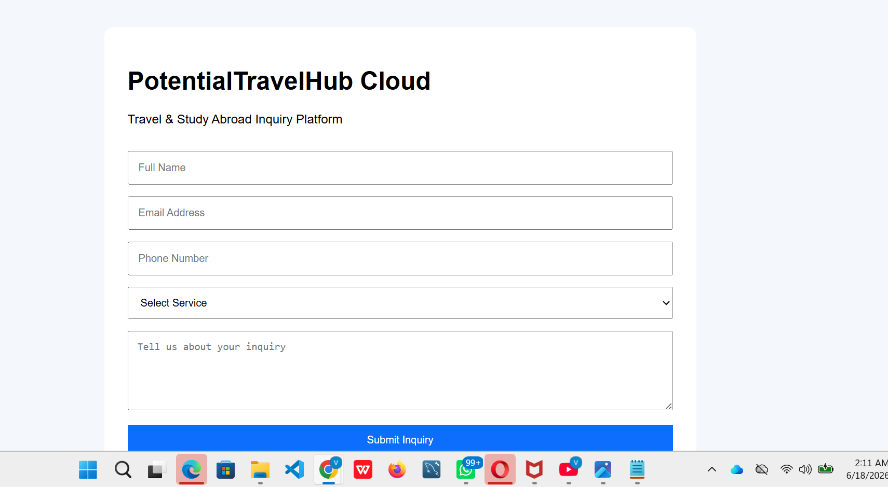

# potentialtravelhub-cloud
Serverless travel and study-abroad inquiry platform built with AWS CloudFormation, S3, CloudFront, API Gateway, Lambda, DynamoDB, SNS, Route 53, ACM, and IAM.

# PotentialTravelHub Cloud

## Serverless Travel & Study Abroad Inquiry Platform

PotentialTravelHub Cloud is a serverless web application designed to streamline travel and study-abroad inquiry management. The platform enables prospective clients to submit inquiries through a web-based form, which are processed automatically using AWS serverless services.

The solution demonstrates the implementation of a scalable, event-driven architecture built with Amazon API Gateway, AWS Lambda, Amazon DynamoDB, Amazon SNS, AWS CloudFormation, and other AWS services. The project highlights modern cloud-native design principles including Infrastructure as Code (IaC), serverless computing, managed databases, and automated notifications.

---

# Project Objectives

The primary objectives of this project are to:

* Build a fully serverless inquiry management platform.
* Automate inquiry processing and notifications.
* Implement Infrastructure as Code using AWS CloudFormation.
* Demonstrate secure and scalable cloud architecture patterns.
* Showcase practical AWS Solutions Architect skills through a real-world business use case.

---

# Architecture Overview

The platform follows a multi-layer serverless architecture designed for scalability, reliability, and cost efficiency.

## Architecture Layers

### Frontend Layer

* Amazon Route 53
* AWS Certificate Manager (ACM)
* Amazon CloudFront
* Amazon S3 Frontend Bucket

### Application Layer

* Amazon API Gateway
* AWS Lambda

### Data & Notification Layer

* Amazon DynamoDB
* Amazon SNS
* Amazon S3 Document Bucket (Future Enhancement)

### Monitoring Layer

* Amazon CloudWatch

---

# Request Flow

1. Users access the application through a web browser.
2. Amazon Route 53 routes requests to CloudFront.
3. CloudFront delivers frontend content securely using an ACM SSL/TLS certificate.
4. Static frontend assets are served from an Amazon S3 bucket.
5. The frontend submits inquiry requests to Amazon API Gateway.
6. API Gateway invokes the AWS Lambda function.
7. Lambda processes and validates the request.
8. Inquiry information is stored in Amazon DynamoDB.
9. Lambda publishes a notification message to Amazon SNS.
10. SNS sends an email notification to the administrator.
11. Amazon CloudWatch captures logs and operational metrics.

---

# AWS Services Used

## Amazon API Gateway

* Provides a secure public API endpoint.
* Receives inquiry submissions from the frontend.
* Routes requests to AWS Lambda.

## AWS Lambda

* Processes inquiry requests.
* Generates unique inquiry identifiers.
* Stores inquiry records in DynamoDB.
* Publishes notification messages to SNS.
* Returns API responses to the frontend.

## Amazon DynamoDB

* Stores inquiry records.
* Uses serverless on-demand capacity mode.
* Provides highly available and scalable data storage.

### Stored Attributes

* Inquiry ID
* Full Name
* Email Address
* Phone Number
* Service Type
* Inquiry Message
* Timestamp

## Amazon SNS

* Sends email notifications for new inquiries.
* Provides near real-time alerting functionality.

## Amazon CloudWatch

* Captures Lambda execution logs.
* Provides monitoring and troubleshooting capabilities.
* Supports operational visibility across the application.

## AWS IAM

* Manages permissions and access control.
* Grants Lambda access to DynamoDB and SNS resources following the principle of least privilege.

## AWS CloudFormation

* Automates infrastructure deployment.
* Ensures repeatable and consistent resource provisioning.
* Supports Infrastructure as Code best practices.

## Amazon S3

* Planned frontend hosting layer.
* Planned document storage layer for supporting client uploads.

## Amazon CloudFront

* Planned global content delivery layer.
* Improves website performance and security.

## Amazon Route 53

* Planned DNS routing service.
* Supports custom domain integration.

## AWS Certificate Manager (ACM)

* Planned SSL/TLS certificate management.
* Enables secure HTTPS communication.

---

# Key Features

* Fully serverless architecture
* Automated inquiry processing
* Real-time email notifications
* Persistent data storage
* Infrastructure as Code (IaC)
* Event-driven workflow
* Scalable and cost-efficient design
* Managed AWS services
* Low operational overhead

---

# Infrastructure Deployment

Core backend infrastructure was deployed using AWS CloudFormation.

### Resources Provisioned

* DynamoDB Table
* SNS Topic
* IAM Execution Role
* Lambda Function

API Gateway integrations and frontend connectivity were configured separately to complete the end-to-end workflow.

---

# Challenges Encountered & Solutions

## 1. CORS Configuration Issues

### Problem

The frontend application was unable to communicate with API Gateway due to Cross-Origin Resource Sharing (CORS) restrictions.

### Solution

* Enabled CORS in API Gateway.
* Added Access-Control-Allow-Origin headers to Lambda responses.
* Redeployed the API after updating configurations.

---

## 2. Missing Lambda Integration

### Problem

The API route was created successfully but did not have a Lambda integration attached.

### Solution

* Attached the Lambda function to the POST /inquiry route.
* Verified deployment and integration functionality.

---

## 3. JSON Response Parsing Errors

### Problem

The frontend expected JSON responses while the backend initially returned incompatible response formats.

### Solution

* Updated Lambda responses to return properly formatted JSON.
* Added frontend validation and error handling.

---

## 4. API Gateway Deployment Challenges

### Problem

The API route existed but changes were not reflected due to deployment and stage configuration issues.

### Solution

* Verified the $default stage configuration.
* Redeployed API Gateway.
* Tested endpoints using browser developer tools and Live Server.

---

# Skills Demonstrated

### Cloud Architecture

* AWS Serverless Architecture Design
* Event-Driven Architecture
* Multi-Tier Application Design

### AWS Services

* Amazon API Gateway
* AWS Lambda
* Amazon DynamoDB
* Amazon SNS
* AWS IAM
* Amazon CloudWatch
* AWS CloudFormation

### Development & Integration

* Frontend and Backend Integration
* REST API Development
* JSON Processing
* CORS Troubleshooting
* Error Handling

### Infrastructure as Code

* CloudFormation Templates
* Automated Resource Provisioning
* Repeatable Deployments

---

# Future Enhancements

The architecture is designed to support additional enterprise-grade capabilities including:

* Amazon S3 document upload support
* CloudFront production deployment
* Custom domain integration
* HTTPS implementation using ACM
* Amazon Cognito authentication
* Administrative dashboard
* Inquiry analytics and reporting
* Role-based access control
* Multi-user support
* File attachment processing

---

# Frontend Preview

---

# Author

**Victor Pius Usen**

AWS Certified Solutions Architect – Associate

Founder & CEO, Potential Travel & Edu Hub Ltd

---

# Project Status

✅ Backend Serverless Workflow Completed

✅ API Gateway Integration Completed

✅ Lambda Processing Completed

✅ DynamoDB Storage Completed

✅ SNS Email Notifications Completed

✅ CloudFormation Deployment Completed

🚧 Production Hosting Layer (S3, CloudFront, Route 53, ACM) Planned
