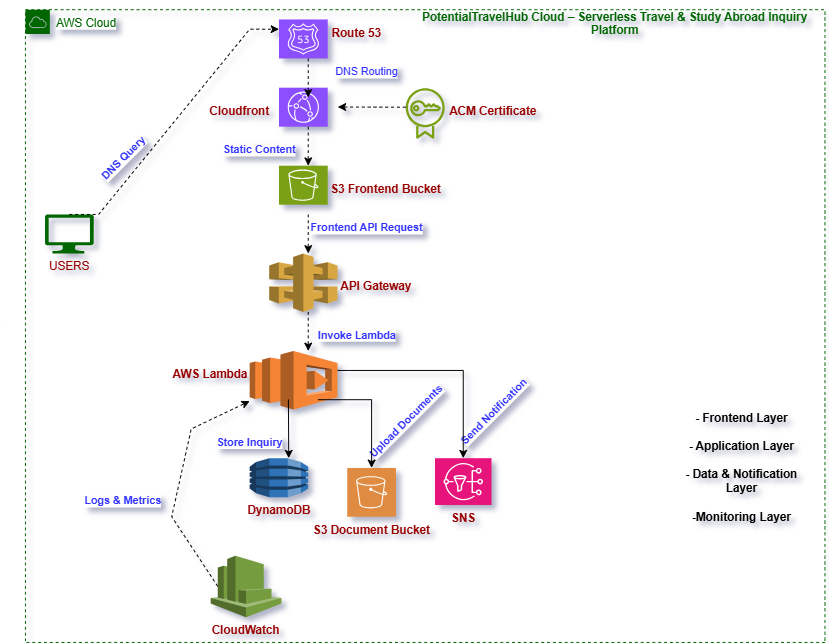
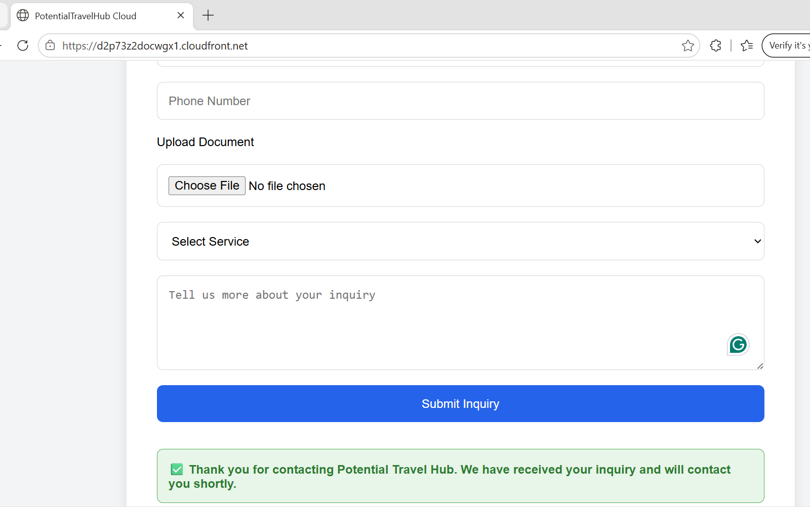
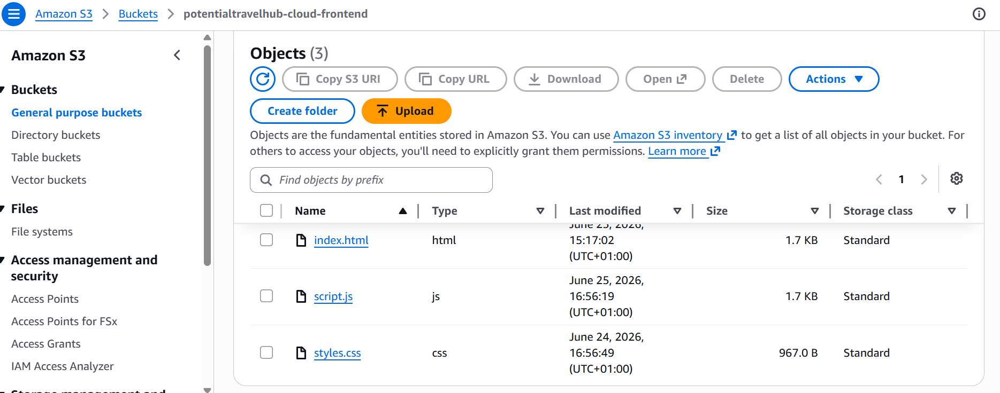
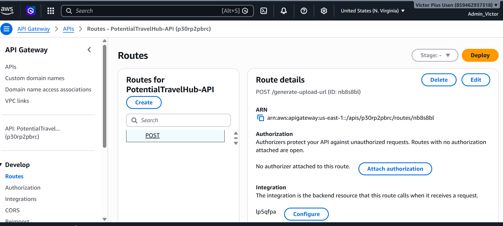
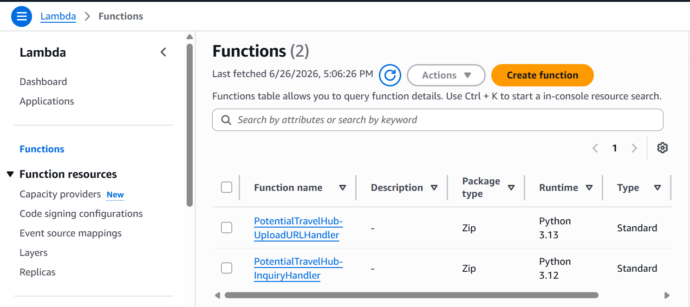
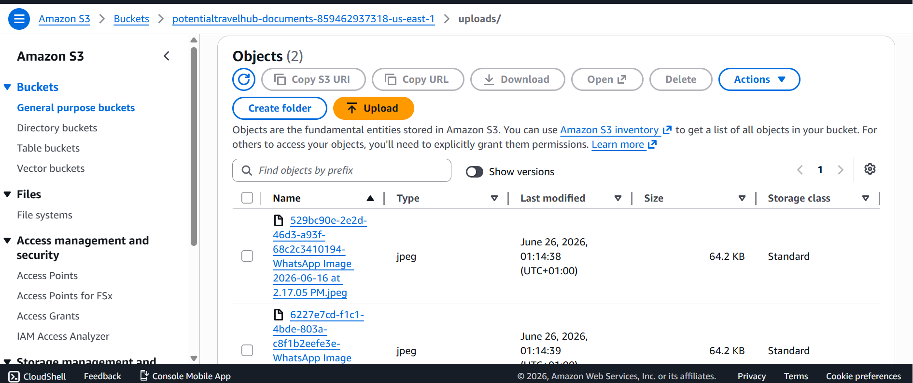
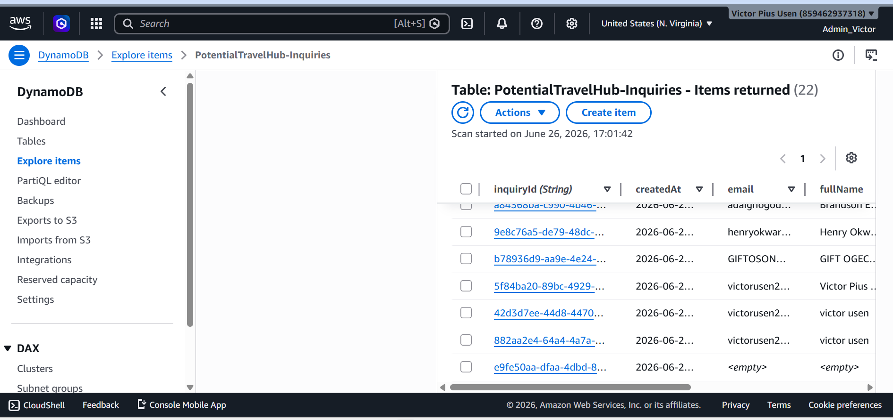
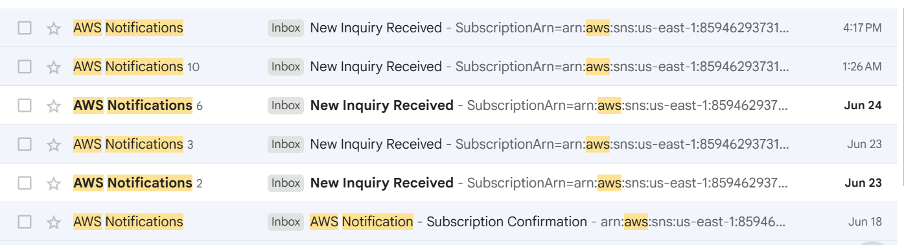
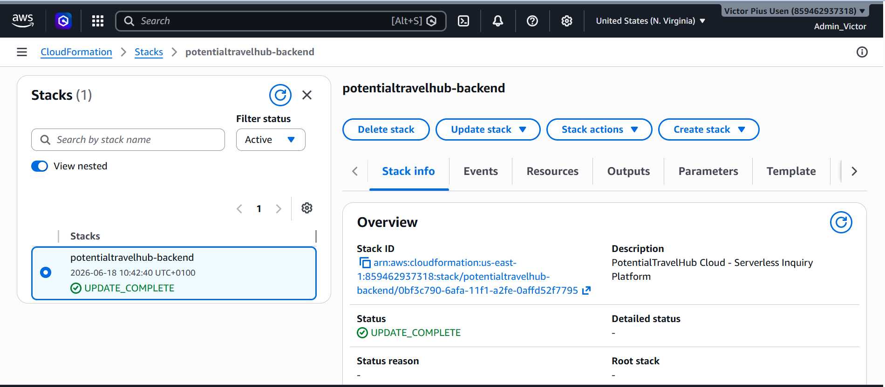
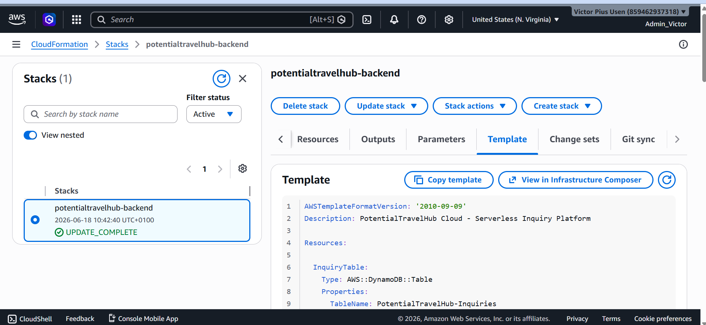

# PotentialTravelHub Cloud

## Serverless Travel & Study Abroad Inquiry Platform


[](https://d2p73z2docwgx1.cloudfront.net)

[](README.md)

[](diagrams/architecture-diagram.png)

[](https://linkedin.com/in/YOUR_PROFILE)

[](mailto:YOUR_EMAIL)
> **A Production-Ready Serverless Travel & Study Abroad Inquiry Platform Built on AWS**

## Overview

**PotentialTravelHub Cloud** is a production-style serverless web application designed to automate travel and study-abroad inquiry management using Amazon Web Services (AWS).

The platform enables prospective clients to submit inquiries and supporting documents through a secure web interface hosted on Amazon CloudFront and Amazon S3. Behind the scenes, AWS serverless services process each request, securely store uploaded documents, persist inquiry records, and automatically notify administrators of new submissions.

This project demonstrates how modern AWS services can be combined to build a highly available, scalable, secure, and cost-effective cloud-native application with minimal operational overhead.

The solution follows AWS Well-Architected principles by leveraging managed services, event-driven processing, Infrastructure as Code (IaC), and serverless computing to eliminate server management while maintaining high scalability and reliability.

---

# Project Objectives

This project was built to demonstrate the practical implementation of a modern serverless application architecture while solving a real-world business problem.

The primary objectives include:

* Design and deploy a fully serverless web application on AWS.
* Automate travel and study-abroad inquiry processing.
* Securely upload and store supporting documents using Amazon S3 Pre-Signed URLs.
* Store inquiry records in a scalable NoSQL database (Amazon DynamoDB).
* Deliver near real-time administrator notifications using Amazon SNS.
* Implement Infrastructure as Code (IaC) using AWS CloudFormation.
* Showcase best practices in AWS architecture, security, scalability, and event-driven application design.

---

# Solution Architecture

The application follows a multi-tier serverless architecture consisting of presentation, application, storage, and monitoring layers.

## Architecture Diagram

The diagram below illustrates the complete architecture of the application.



### Architecture Components

### Presentation Layer

* Amazon Route 53
* AWS Certificate Manager (ACM)
* Amazon CloudFront
* Amazon S3 Frontend Bucket

Responsible for securely delivering the static frontend application over HTTPS with low latency through Amazon CloudFront.

---

### API Layer

* Amazon API Gateway

Provides secure REST API endpoints that receive requests from the frontend and route them to the appropriate AWS Lambda function.

The application exposes two REST endpoints:

| Endpoint                      | Purpose                                                            |
| ----------------------------- | ------------------------------------------------------------------ |
| **POST /generate-upload-url** | Generates an Amazon S3 Pre-Signed URL for secure document uploads. |
| **POST /inquiry**             | Processes customer inquiries and stores them in Amazon DynamoDB.   |

---

### Compute Layer

Two independent AWS Lambda functions handle different business responsibilities.

#### UploadURLHandler

Responsible for:

* Generating secure Amazon S3 Pre-Signed URLs.
* Returning temporary upload URLs to the frontend.
* Preventing direct public access to the document bucket.

#### InquiryHandler

Responsible for:

* Validating inquiry submissions.
* Processing customer information.
* Storing inquiry records in Amazon DynamoDB.
* Publishing notification messages to Amazon SNS.

---

### Storage Layer

#### Amazon DynamoDB

Stores inquiry records including:

* Inquiry ID
* Customer Name
* Email Address
* Phone Number
* Selected Service
* Inquiry Message
* Uploaded Document Key
* Submission Timestamp

#### Amazon S3 Document Bucket

Stores uploaded customer documents securely using Pre-Signed URLs without exposing the bucket publicly.

---

### Notification Layer

#### Amazon SNS

Automatically sends email notifications whenever a new inquiry is successfully submitted.

---

### Monitoring Layer

#### Amazon CloudWatch

Captures Lambda execution logs, API activity, and operational metrics for monitoring and troubleshooting.

---

# End-to-End Workflow

The following workflow describes how a customer inquiry moves through the application.

1. A customer accesses the website through Amazon CloudFront.

2. CloudFront securely delivers the static frontend hosted in the Amazon S3 Frontend Bucket.

3. The customer completes the inquiry form and optionally selects a supporting document.

4. The frontend requests a secure upload URL by calling:

```text
POST /generate-upload-url
```

5. Amazon API Gateway invokes the **UploadURLHandler** Lambda function.

6. UploadURLHandler generates a temporary Amazon S3 Pre-Signed URL and returns it to the frontend.

7. The browser uploads the selected document directly to the Amazon S3 Document Bucket using the generated Pre-Signed URL.

8. After the upload completes successfully, the frontend submits the inquiry details by calling:

```text
POST /inquiry
```

9. Amazon API Gateway invokes the **InquiryHandler** Lambda function.

10. InquiryHandler validates the request and stores the inquiry record in Amazon DynamoDB.

11. InquiryHandler publishes a notification message to Amazon SNS.

12. Amazon SNS immediately sends an email notification to the administrator.

13. Amazon CloudWatch captures logs and execution metrics for both Lambda functions, providing operational visibility and troubleshooting capabilities.

---

# Repository Structure

```text
potentialtravelhub-cloud
│
├── cloudformation/
│   └── template.yaml
│
├── diagrams/
│   └── architecture-diagram.png
│
├── frontend/
│   ├── index.html
│   ├── styles.css
│   └── script.js
│
├── lambda/
│   ├── inquiry-handler.py
│   ├── upload-url-handler.py
│   └── requirements.txt
│
├── screenshots/
│   ├── 01-cloudfront-success.png
│   ├── 02-s3-frontend-bucket.png
│   ├── 03-s3-document-bucket.png
│   ├── 04-api-gateway-routes.png
│   ├── 05-lambda-functions.png
│   ├── 06-dynamodb-record.png
│   ├── 07-sns-email.png
│   ├── 08-cloudformation-stack.png
│   ├── 09-cloudformation-template.png
│   └── 10-local-frontend-preview.png
│
├── README.md
│
└── LICENSE
```


---

# AWS Services Used

The application leverages a collection of fully managed AWS services to deliver a secure, scalable, highly available, and cost-effective serverless solution.

| AWS Service                       | Purpose                                                                   |
| --------------------------------- | ------------------------------------------------------------------------- |
| **Amazon Route 53**               | Routes user requests to the application using DNS.                        |
| **AWS Certificate Manager (ACM)** | Provides SSL/TLS certificates for secure HTTPS communication.             |
| **Amazon CloudFront**             | Delivers the frontend globally with low latency and improved security.    |
| **Amazon S3 (Frontend Bucket)**   | Hosts the static HTML, CSS, and JavaScript application.                   |
| **Amazon API Gateway**            | Exposes secure REST API endpoints for frontend communication.             |
| **AWS Lambda (InquiryHandler)**   | Processes customer inquiries and business logic.                          |
| **AWS Lambda (UploadURLHandler)** | Generates secure Amazon S3 Pre-Signed URLs for document uploads.          |
| **Amazon DynamoDB**               | Stores inquiry records using serverless NoSQL storage.                    |
| **Amazon S3 (Document Bucket)**   | Securely stores uploaded customer documents.                              |
| **Amazon SNS**                    | Sends automatic email notifications for new inquiries.                    |
| **Amazon CloudWatch**             | Captures application logs, monitoring data, and operational metrics.      |
| **AWS IAM**                       | Implements secure access control and least-privilege permissions.         |
| **AWS CloudFormation**            | Automates infrastructure provisioning using Infrastructure as Code (IaC). |

---

# Project Walkthrough

The following screenshots demonstrate the complete deployment and functionality of the application.

---

## 1. Local Frontend Development

The application was initially developed and tested locally before deployment to AWS.


---

## 2. CloudFront Production Deployment

The frontend application is deployed to Amazon S3 and delivered globally through Amazon CloudFront, providing secure HTTPS access and low-latency content delivery.



---

## 3. Amazon S3 Frontend Bucket

The frontend bucket stores all static website assets, including HTML, CSS, and JavaScript files that power the application.

**Contents include:**

* index.html
* styles.css
* script.js



---

## 4. API Gateway

Amazon API Gateway provides secure REST endpoints used by the frontend application.

### Available Endpoints

| Method | Endpoint               | Description                                  |
| ------ | ---------------------- | -------------------------------------------- |
| POST   | `/generate-upload-url` | Generates a secure Amazon S3 Pre-Signed URL. |
| POST   | `/inquiry`             | Processes and stores customer inquiries.     |



---

## 5. AWS Lambda Functions

The application uses two independent AWS Lambda functions.

### InquiryHandler

Responsible for:

* Processing customer inquiries
* Validating request data
* Writing inquiry records to DynamoDB
* Publishing SNS notifications

### UploadURLHandler

Responsible for:

* Generating Amazon S3 Pre-Signed URLs
* Securing document uploads
* Preventing direct public bucket access



---

## 6. Amazon S3 Document Upload

Supporting documents uploaded by customers are stored securely in a dedicated Amazon S3 bucket.

Instead of exposing the bucket publicly, uploads are performed using temporary Amazon S3 Pre-Signed URLs generated by AWS Lambda.

This approach improves security while allowing users to upload files directly to Amazon S3.

Supported upload examples include:

* Passport copies
* Academic transcripts
* Certificates
* Identification documents



---

## 7. Amazon DynamoDB

Customer inquiries are automatically stored in Amazon DynamoDB after successful validation.

Each record contains:

* Inquiry ID
* Customer Name
* Email Address
* Phone Number
* Requested Service
* Inquiry Message
* Uploaded Document Key
* Submission Timestamp

The application uses DynamoDB On-Demand Capacity Mode, allowing automatic scaling without capacity planning.



---

## 8. Amazon SNS Email Notifications

Immediately after an inquiry is stored successfully, AWS Lambda publishes a notification to Amazon SNS.

Amazon SNS automatically sends an email notification to the administrator, ensuring new customer inquiries receive prompt attention.



---

# Infrastructure Deployment

The core backend infrastructure was provisioned using AWS CloudFormation, enabling repeatable, consistent, and automated deployments.

### Resources Provisioned

* AWS Lambda Functions
* Amazon DynamoDB Table
* Amazon SNS Topic
* IAM Roles and Policies

Additional AWS services, including Amazon API Gateway, Amazon CloudFront, Amazon Route 53, Amazon S3, and AWS Certificate Manager, were configured to complete the production deployment.

---

## CloudFormation Stack

The CloudFormation stack successfully provisions the application's backend resources.



---

## Infrastructure as Code

The infrastructure template defines the core AWS resources required by the application, demonstrating Infrastructure as Code (IaC) principles and enabling repeatable deployments.




---

# Engineering Challenges & Solutions

Building a production-ready serverless application involved solving several real-world engineering challenges. The following issues were encountered during development and resolved through systematic troubleshooting and AWS best practices.

---

## 1. Cross-Origin Resource Sharing (CORS)

### Challenge

The frontend application could not communicate with Amazon API Gateway due to Cross-Origin Resource Sharing (CORS) restrictions.

### Resolution

* Configured CORS for API Gateway routes.
* Added the required `Access-Control-Allow-Origin` headers to Lambda responses.
* Redeployed the API to apply the updated configuration.

---

## 2. API Gateway Integration

### Challenge

The API routes were created successfully, but requests were not reaching the Lambda functions because integrations had not been configured.

### Resolution

* Connected each API Gateway route to its corresponding AWS Lambda function.
* Verified integrations using API Gateway route testing and browser developer tools.

---

## 3. JSON Response Handling

### Challenge

The frontend expected JSON responses while the backend initially returned incompatible response formats.

### Resolution

* Updated Lambda functions to return properly formatted JSON responses.
* Added frontend validation and improved error handling.

---

## 4. CloudFront Cache Invalidation

### Challenge

Frontend updates were not immediately visible after modifying HTML, CSS, and JavaScript files due to CloudFront caching.

### Resolution

* Uploaded updated frontend assets to the Amazon S3 frontend bucket.
* Created CloudFront invalidations to refresh cached content.

---

## 5. Secure Document Uploads

### Challenge

Direct browser uploads to Amazon S3 required secure access without exposing the document bucket publicly.

### Resolution

* Implemented a dedicated UploadURLHandler Lambda function.
* Generated temporary Amazon S3 Pre-Signed URLs.
* Uploaded documents securely from the browser directly to Amazon S3.

---

## 6. IAM Permissions

### Challenge

AWS Lambda initially lacked sufficient permissions to access required AWS services.

### Resolution

Configured least-privilege IAM policies allowing Lambda functions to:

* Read and write Amazon DynamoDB records.
* Publish Amazon SNS notifications.
* Generate Amazon S3 Pre-Signed URLs.
* Upload documents securely.

---

## 7. End-to-End Testing

### Challenge

Multiple AWS services needed to work together seamlessly across the entire application workflow.

### Resolution

Performed complete end-to-end testing to verify:

* Frontend deployment
* API Gateway routing
* Lambda execution
* Secure document uploads
* DynamoDB storage
* SNS notifications
* CloudWatch logging

---

# Skills Demonstrated

This project demonstrates practical experience across multiple cloud engineering disciplines.

## Cloud Architecture

* AWS Serverless Architecture
* Event-Driven Design
* Multi-Tier Cloud Architecture
* AWS Well-Architected Principles

---

## AWS Services

* Amazon API Gateway
* AWS Lambda
* Amazon S3
* Amazon CloudFront
* Amazon DynamoDB
* Amazon SNS
* AWS IAM
* Amazon CloudWatch
* AWS CloudFormation
* Amazon Route 53
* AWS Certificate Manager (ACM)

---

## Development

* REST API Integration
* Frontend and Backend Integration
* JSON Processing
* JavaScript
* Python
* Error Handling
* Browser Debugging
* Cloud Troubleshooting

---

## Security

* IAM Least-Privilege Access
* Secure HTTPS Delivery
* Amazon S3 Pre-Signed URLs
* Secure File Upload Architecture

---

## Infrastructure as Code

* AWS CloudFormation
* Automated Infrastructure Deployment
* Repeatable Cloud Provisioning

---

# Future Enhancements

The architecture has been intentionally designed to support future enterprise-scale improvements.

Planned enhancements include:

* Amazon Cognito user authentication
* Administrative dashboard
* Customer inquiry tracking portal
* Amazon SES customer confirmation emails
* Amazon EventBridge automation
* Amazon SQS asynchronous processing
* AWS X-Ray distributed tracing
* CI/CD pipeline using GitHub Actions
* AWS WAF integration
* Custom analytics dashboard
* Automated backup and disaster recovery
* Multi-language frontend support

---

# Project Status

| Component                     | Status      |
| ----------------------------- | ----------- |
| Serverless Architecture       | ✅ Completed |
| CloudFormation Infrastructure | ✅ Completed |
| Amazon CloudFront Deployment  | ✅ Completed |
| Amazon S3 Frontend Hosting    | ✅ Completed |
| Amazon API Gateway            | ✅ Completed |
| AWS Lambda Functions          | ✅ Completed |
| Amazon DynamoDB               | ✅ Completed |
| Amazon SNS Notifications      | ✅ Completed |
| Amazon S3 Document Uploads    | ✅ Completed |
| Amazon S3 Pre-Signed URLs     | ✅ Completed |
| Amazon CloudWatch Monitoring  | ✅ Completed |
| HTTPS Delivery                | ✅ Completed |
| Administrative Dashboard      | 🚧 Planned  |
| Amazon Cognito Authentication | 🚧 Planned  |
| CI/CD Pipeline                | 🚧 Planned  |

---

# Key Takeaways

This project demonstrates the implementation of a complete serverless application using AWS managed services. It showcases practical experience in cloud architecture, Infrastructure as Code (IaC), secure API development, event-driven processing, and scalable storage solutions.

Rather than relying on traditional servers, the application embraces a fully managed serverless architecture that minimizes operational overhead while maximizing scalability, security, and reliability.

The project reflects real-world AWS Solutions Architect practices and highlights the ability to design, deploy, troubleshoot, and document cloud-native applications using industry best practices.

---

# Author

## Victor Pius Usen

**AWS Certified Solutions Architect – Associate**

Founder & CEO
**Potential Travel & Edu Hub Ltd**

### Connect With Me

* LinkedIn: https://www.linkedin.com/in/victor-u-033a17135/
* GitHub: https://github.com/Vickusen23
* Email: victorusen23@gmail.com

---

# Acknowledgements

This project was developed as part of my continuous journey in cloud computing, applying AWS best practices to solve a real-world business problem through modern serverless architecture.

Special thanks to the AWS documentation, learning resources, and the cloud engineering community for continually advancing best practices in cloud-native application development.
